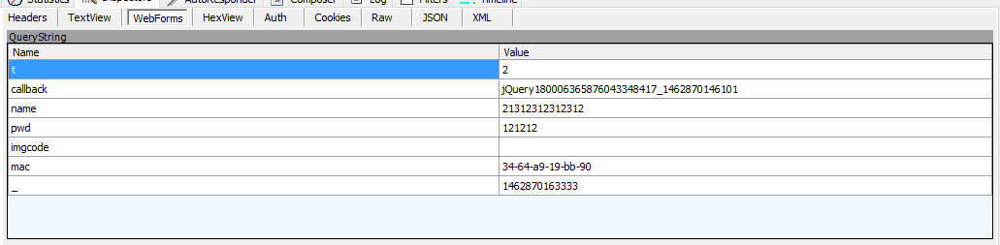
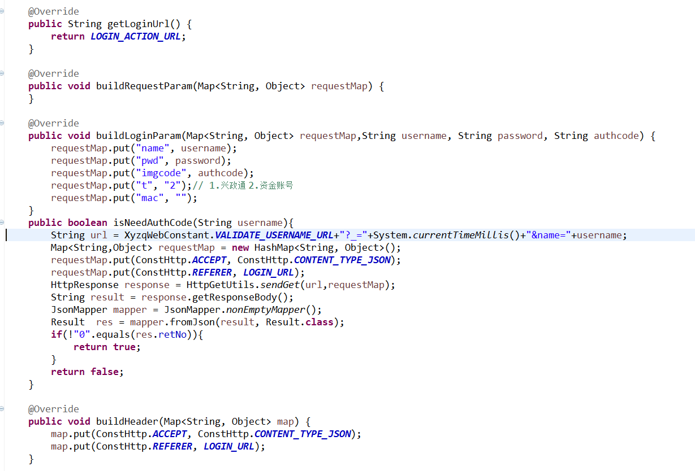

> Author: 法尔梅·邱

## 以某一证券为实例
   * 第一步 探索入口，决定后期开发的难度，因为有些入口比较难克服（首选web）
      （https://estock.xyzq.com.cn/）
   * 第二步 探索登录表单，是否有控件，是否加密（发现有activeX控件，但是不要紧张，看看入參）
      
   * 第三步 利用fiddler观察提交表单
    
     fuck，密码并没有经过控件加密
   * 第四步 是否需要验证码，利用fiddler可以观察到，用户输入完用户名时，调用了是否需要验证码的接口
   * 第五步 利用java代码去模拟即可,伪代码实例  
 ## 注意的问题
    * 需要设置特定的头参数（ACCEPT，REFERER）

## 关于作者

  法梅尔.邱 码农一枚，志存高远，并为之努力！QQ:344651570 欢迎交流
